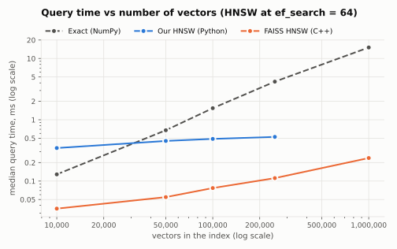
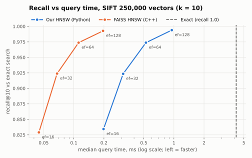

# vector-search

A vector retrieval service built around a from-scratch HNSW index, benchmarked
against exact search and FAISS on the [BEIR SciFact](https://github.com/beir-cellar/beir) dataset.

> Work in progress. Every number below comes from a recorded run in
> [`results/`](results/), tagged with the commit that produced it.

## Architecture

```
client ──► vector-search API (FastAPI)
              ├──► Throttle (C++ / Redis token-bucket rate limiter)
              ├──► embed query (sentence-transformers / OpenAI)
              ├──► vector index (from-scratch HNSW | FAISS | exact)
              ├──► re-rank (cross-encoder)
              └──► optional grounded answer (OpenAI)
```

## Results

### Phase 1: exact search on SciFact (300 test queries, 5,183 docs)

| Model | Chunking | Chunks | Truncated | R@1 | R@10 | MRR@10 | nDCG@10 | Search p50 |
|---|---|---:|---:|---:|---:|---:|---:|---:|
| all-MiniLM-L6-v2 | whole document | 5,183 | 71.0% | 0.482 | 0.783 | 0.605 | 0.645 | 0.10 ms |
| all-MiniLM-L6-v2 | fixed 200 words, 40 overlap | 8,184 | 49.2% | 0.474 | 0.802 | 0.605 | 0.648 | 0.16 ms |
| all-MiniLM-L6-v2 | fixed 100 words, 20 overlap | 15,153 | 0.2% | **0.518** | **0.827** | **0.630** | **0.674** | 0.43 ms |

- **Sanity check:** the whole-document nDCG@10 of 0.645 matches the published BEIR result for this model on SciFact.
- **Truncation:** MiniLM reads at most 256 tokens and silently drops the rest. Scientific text averages about 1.6 tokens per word (measured: 337 tokens vs 215 words per abstract), so 71% of abstracts and even half of the 200-word chunks get cut off. Chunks short enough to fit raise nDCG@10 by 0.029.
- **Latency:** exact search time grows linearly with the number of chunks (3× the chunks, about 4× the p50). That cost is what HNSW is meant to avoid at scale.

Reproduce:

```bash
.venv/bin/pip install -e '.[dev,embed]'
.venv/bin/python -m vector.eval.run --model minilm --chunker whole fixed-200-40 fixed-100-20
```

### Phase 2: chunking strategy × chunk size × embedding model

Three chunkers (fixed word window, sentence-packing, recursive) at 100 / 150 / 200 words with 20% overlap, plus whole documents, on two local models of the same size (384 dimensions): **all-MiniLM-L6-v2** (256-token limit) and **bge-small-en-v1.5** (512-token limit, queries prefixed with its retrieval instruction). Exact search, 20 configurations, all from commit `49e953d`.

nDCG@10 (best per model in bold):

| Chunking | MiniLM | Truncated | bge-small | Truncated |
|---|---:|---:|---:|---:|
| whole document | 0.645 | 71.0% | 0.713 | 8.8% |
| fixed 100 / 20 | **0.674** | 0.2% | 0.716 | 0% |
| fixed 150 / 30 | 0.652 | 15.2% | 0.713 | 0% |
| fixed 200 / 40 | 0.648 | 49.2% | 0.712 | 0% |
| sentence 100 / 20 | 0.661 | 0.1% | 0.704 | 0% |
| sentence 150 / 30 | 0.653 | 8.2% | **0.726** | 0% |
| sentence 200 / 40 | 0.658 | 43.8% | 0.708 | 0% |
| recursive 100 / 20 | 0.663 | 0.1% | 0.706 | 0% |
| recursive 150 / 30 | 0.654 | 10.1% | 0.717 | 0% |
| recursive 200 / 40 | 0.651 | 44.7% | 0.708 | 0% |

- **The model matters far more than chunking.** bge-small on whole documents (0.713) beats every MiniLM configuration, including MiniLM's best (0.674): Δ = +0.039, 95% CI [+0.013, +0.065], p = 0.004 (paired randomization test).
- **For MiniLM, chunking mostly fixes truncation, but the evidence is moderate.** All three 100-word configurations (≤0.2% truncated) score above every larger one. The best, fixed-100-20, beats whole documents by +0.029, 95% CI [+0.006, +0.051], p = 0.011, but p = 0.10 after Holm correction across the 9 chunkers compared.
- **For bge-small, chunking makes no detectable difference.** It reads 512 tokens (whole abstracts truncated only 8.8%), and no chunker differs from whole documents (all Holm-corrected p ≥ 0.85; the "best", sentence-150-30 at +0.013, has p = 0.09 uncorrected).
- **Recursive ≈ sentence on this data.** Every SciFact document's only paragraph break is between title and abstract, so the recursive splitter falls through to sentences.

Significance: per-query nDCG@10 in `results/phase2_per_query.jsonl` (same numbers as `phase2.jsonl`), compared with `python -m vector.eval.compare results/phase2_per_query.jsonl --base bge-small:whole` (paired randomization test, bootstrap CI, Holm correction).

Full table: `python -m vector.eval.report results/phase2.jsonl`. Reproduce:

```bash
G="whole fixed-100-20 fixed-150-30 fixed-200-40 sentence-100-20 sentence-150-30 sentence-200-40 recursive-100-20 recursive-150-30 recursive-200-40"
.venv/bin/python -m vector.eval.run --model minilm    --chunker $G --out results/phase2.jsonl
.venv/bin/python -m vector.eval.run --model bge-small --chunker $G --out results/phase2.jsonl
```

### Phase 3: from-scratch HNSW vs exact search

`vector/index/hnsw.py`: a pure-Python HNSW (Malkov & Yashunin, 2018) with the same `add`/`search` interface as the exact index. **ANN recall@10** is the share of the exact top-10 chunks that HNSW also returns; **scored** is how many vectors each query is compared against. HNSW spec = `M`-`ef_construction`-`ef_search`. All runs from commit `f854c96`.

| Data | Index | ANN recall@10 | nDCG@10 | Scored / query | Search p50 | Build |
|---|---|---:|---:|---:|---:|---:|
| bge-small, whole docs (5,183) | exact | 1.000 | 0.713 | 5,183 | 0.12 ms | 0.01 s |
| | HNSW 16-200-100 | 0.997 | 0.713 | 1,108 | 0.70 ms | 7.9 s |
| | HNSW 16-200-200 | 1.000 | 0.713 | 1,740 | 1.21 ms | (same graph) |
| | HNSW 8-100-100 | 0.991 | 0.713 | 720 | 0.58 ms | 3.7 s |
| MiniLM, fixed-100-20 (15,153) | exact | 1.000 | 0.674 | 15,153 | 0.44 ms | 0.01 s |
| | HNSW 16-200-100 | 0.996 | 0.673 | 1,360 | 0.89 ms | 27.6 s |
| | HNSW 16-200-200 | 0.999 | 0.674 | 2,285 | 1.55 ms | (same graph) |
| | HNSW 8-100-100 | 0.986 | 0.666 | 798 | 0.68 ms | 11.8 s |

- **Accurate:** ANN recall@10 of 0.99–1.00, and end-to-end retrieval quality (nDCG@10) within 0.001 of exact search at M = 16.
- **Does far less work:** about 9% of the vectors per query at 15K chunks (1,360 of 15,153).
- **But slower at this size:** exact search is one NumPy matrix-vector product running in C, while HNSW takes hundreds of small Python steps. As the data grew 2.9×, exact search slowed 3.6× but HNSW only 1.3× (and scored 23% more vectors), so the gap shrank from 5.6× to 2×. Phase 4 measures where they cross on 1M vectors.
- Latencies were measured on an 8 GB M2 under memory pressure (heavy swap); the trends are clear, but absolute times are rough.

Reproduce:

```bash
.venv/bin/python -m vector.eval.run --model bge-small --chunker whole \
    --index flat hnsw-16-200-100 hnsw-16-200-200 hnsw-16-200-400 hnsw-8-100-100 --out results/phase3.jsonl
.venv/bin/python -m vector.eval.run --model minilm --chunker fixed-100-20 \
    --index flat hnsw-16-200-100 hnsw-16-200-200 hnsw-8-100-100 --out results/phase3.jsonl
```

### Phase 4: speed at scale: exact vs our HNSW vs FAISS (SIFT1M)

SciFact is too small to show what HNSW is for, so this phase uses **SIFT1M** (1M image descriptors, 128 dimensions), searched by cosine like the rest of the project. Exact search over the first *n* vectors is the answer key; 1,000 queries, k = 10, one query at a time, single thread. HNSW: M = 16, ef_construction = 100, both implementations. Our Python HNSW stops at 250K (its graph would need about 1.5 GB of RAM at 1M on this 8 GB laptop); exact and FAISS go to 1M.





Median query time (recall@10 in parentheses), HNSW at ef_search = 64:

| Vectors | Exact (NumPy) | Our HNSW (Python) | FAISS HNSW (C++) |
|---:|---:|---:|---:|
| 10,000 | 0.13 ms (1.000) | 0.35 ms (0.997) | 0.035 ms (0.997) |
| 50,000 | 0.67 ms (1.000) | 0.45 ms (0.992) | 0.055 ms (0.991) |
| 100,000 | 1.55 ms (1.000) | 0.49 ms (0.985) | 0.077 ms (0.984) |
| 250,000 | 4.19 ms (1.000) | **0.53 ms (0.974)** | 0.112 ms (0.974) |
| 1,000,000 | 15.1 ms | n/a | 0.24 ms (0.948) |

- **Our HNSW overtakes exact search between 10K and 50K vectors.** At 250K it's **8× faster** at 0.974 recall (ef 64), or 4.4× faster at 0.994 (ef 128). As the data grew 25× (10K → 250K), exact search slowed 32× while our HNSW slowed 1.5×.
- **Same algorithm quality as FAISS.** At every size and ef_search setting, our recall is within 0.008 of FAISS's (usually ≤ 0.005), so the implementation matches the reference.
- **The remaining gap is the language.** FAISS is 4.7× faster per query at 250K and builds 34× faster (7.5 s vs 259 s): C++ with SIMD vs Python heaps and sets. At 1M, FAISS answers in 0.41 ms at 0.983 recall (ef 128), 37× faster than exact search.
- **Bigger data needs a wider beam.** At fixed ef_search = 64, recall drifts from 0.997 (10K) to 0.948 (1M, FAISS); ef_search has to grow with the data to hold recall.
- Exact search scores 0.999 at 1M, not 1.000, because of **ties**: SIFT1M has 14,538 groups of duplicate vectors, and the 6 "misses" out of 10,000 all have exactly the same score as the 10th result.

Full table: `results/phase4.jsonl` (commits `7a7ed10` / `3c7b563`, identical benchmark code). Reproduce (needs `pip install -e '.[bench]'`; about 15 minutes, SIFT downloads about 160 MB):

```bash
H="flat hnsw-16-100-16 hnsw-16-100-32 hnsw-16-100-64 hnsw-16-100-128"
F="faiss-hnsw-16-100-16 faiss-hnsw-16-100-32 faiss-hnsw-16-100-64 faiss-hnsw-16-100-128"
.venv/bin/python -m vector.eval.bench --n 10000 50000 100000 250000 --index $H $F
.venv/bin/python -m vector.eval.bench --n 1000000 --index flat $F
.venv/bin/python -m vector.eval.plot results/phase4.jsonl
```

### Phase 5: re-ranking with cross-encoders

A cross-encoder reads the query and each passage *together* and re-scores the top chunks from search. Two models: **ms-marco-MiniLM-L-6-v2** (22M parameters, trained on web search) and **bge-reranker-base** (278M). Exact search, 300 SciFact queries, paired randomization tests on per-query nDCG@10 (Holm-corrected within each baseline). Commit `e844e39`.

| First stage | Re-ranker @ depth | nDCG@10 | Δ | 95% CI | p (Holm) | Re-rank p50 |
|---|---|---:|---:|---|---:|---:|
| bge-small, whole docs | none | 0.713 | | | | |
| | ms-marco-MiniLM @ 20 | 0.707 | −0.005 | [−0.031, +0.020] | 1.00 | 0.29 s |
| | ms-marco-MiniLM @ 50 | 0.696 | −0.017 | [−0.044, +0.011] | 0.80 | 0.40 s |
| | ms-marco-MiniLM @ 100 | 0.694 | −0.018 | [−0.046, +0.010] | 0.80 | 1.19 s |
| | bge-reranker-base @ 50 | 0.715 | +0.002 | [−0.023, +0.029] | 1.00 | 2.98 s |
| MiniLM, fixed-100-20 | none | 0.674 | | | | |
| | ms-marco-MiniLM @ 50 | 0.699 | +0.025 | [−0.003, +0.054] | 0.09 | 0.28 s |

- **Re-ranking didn't measurably improve retrieval here.** No configuration differs significantly from no re-ranking. The web-trained MS MARCO model trends *worse* on top of bge-small (scientific claims aren't web queries), and slightly better on top of the weaker MiniLM first stage. The 12× larger bge-reranker ties.
- **It's expensive:** 0.3–3 s per query on this laptop vs about 0.1 ms for the search itself, so it would dominate the service's latency.
- **Conclusion:** a stronger first-stage embedding model (Phase 2: +0.039, p = 0.004) beat every re-ranker tried, at no added query cost. The service ships with re-ranking off by default (opt-in per request).

Reproduce:

```bash
R="--per-query --out results/phase5.jsonl"
.venv/bin/python -m vector.eval.run --model bge-small --chunker whole --rerank none ms-marco-minilm --rerank-depth 50 $R
.venv/bin/python -m vector.eval.run --model bge-small --chunker whole --rerank ms-marco-minilm --rerank-depth 20 $R   # and 100
.venv/bin/python -m vector.eval.run --model bge-small --chunker whole --rerank bge-reranker --rerank-depth 50 $R
.venv/bin/python -m vector.eval.run --model minilm --chunker fixed-100-20 --rerank none ms-marco-minilm $R
.venv/bin/python -m vector.eval.compare results/phase5.jsonl --base bge-small:whole:flat:none
```

## Roadmap

- [x] BEIR dataset loader
- [x] Chunkers: fixed window, sentence-packing, recursive
- [x] Exact (brute-force) index baseline
- [x] recall@k / MRR@k / nDCG@k evaluation
- [x] Embeddings: local sentence-transformers + OpenAI, cached to disk
- [x] Exact-search baseline on SciFact (MiniLM)
- [x] From-scratch HNSW index
- [x] FAISS HNSW comparison (SIFT1M)
- [x] Chunking × embedding-model sweep (local models; OpenAI pending)
- [x] Re-ranking (measured: no significant gain)
- [ ] FastAPI service, persistence, incremental indexing
- [ ] Throttle integration and load testing

## Development

```bash
python3 -m venv .venv
.venv/bin/pip install -e '.[dev,embed]'
.venv/bin/pytest   # offline; no models or API calls
```

SciFact (~8 MB) downloads into `datasets/` on first use. Embeddings are cached in
`datasets/cache/embeddings/`, so reruns skip the model. OpenAI runs need
`OPENAI_API_KEY` in a `.env` file at the repo root.
